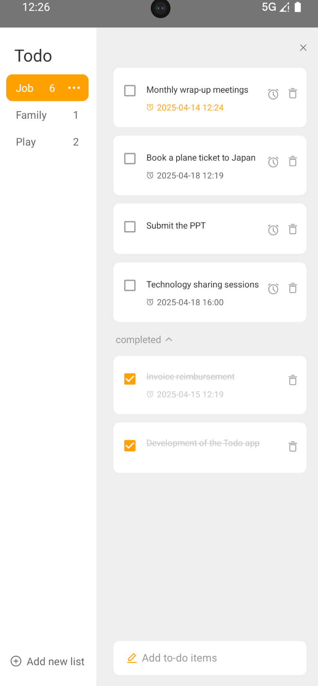
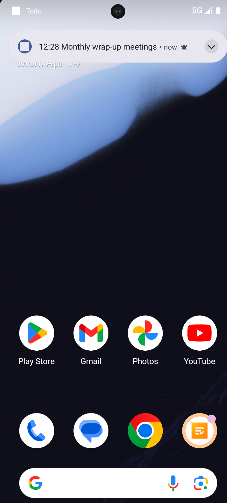
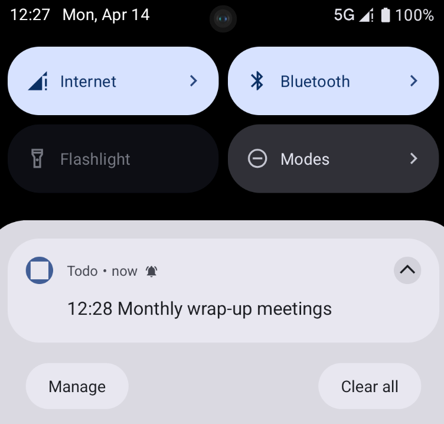
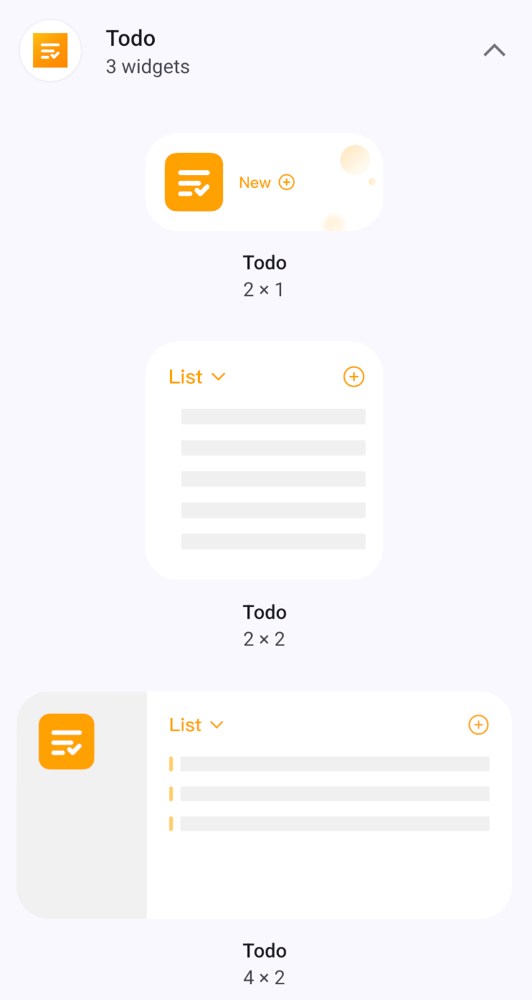
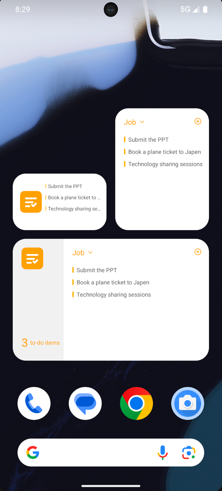

# Todo App
A to-do app that includes functions such as creating categories, adding, deleting, modifying, and reminding to-dos

# Feature display
1. The left side of the main interface includes creating categories (supporting category renaming and one click deletion of categories)
2. On the right side are the to-do items under each category (supporting adding, deleting, marking completion or not, and setting reminders)
   

3. After setting reminders, to-do events will be reminded ten minutes in advance

4. Provides three sizes of desktop widgets for display and interaction

# Technical points used
- MVVM
- Room（Database for storing to-do items）
- App Widget
- Singleton pattern
- Notification（Notification display and dynamic application of notification permissions）
- AlarmManager（Implement alarm reminder function）

# Demo Apk
[Todo Demo Apk](readme_res/Todo.apk)

# Project source code address
https://github.com/HumorousRR/Todo

